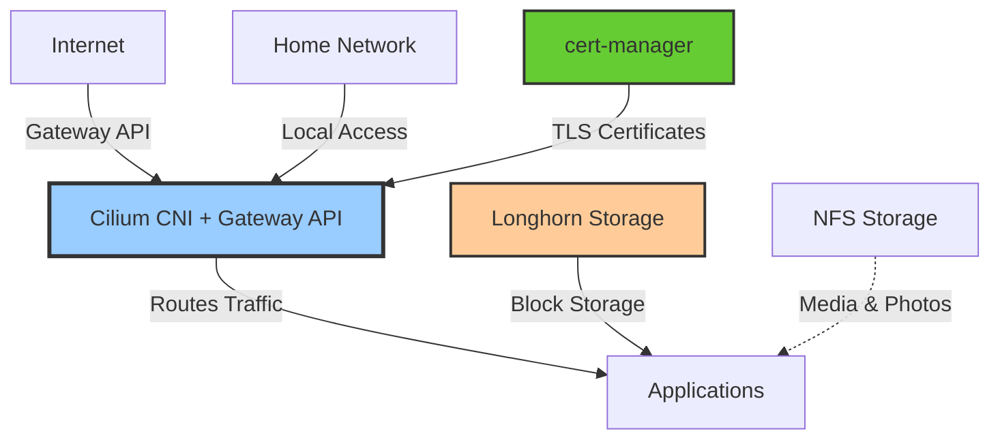
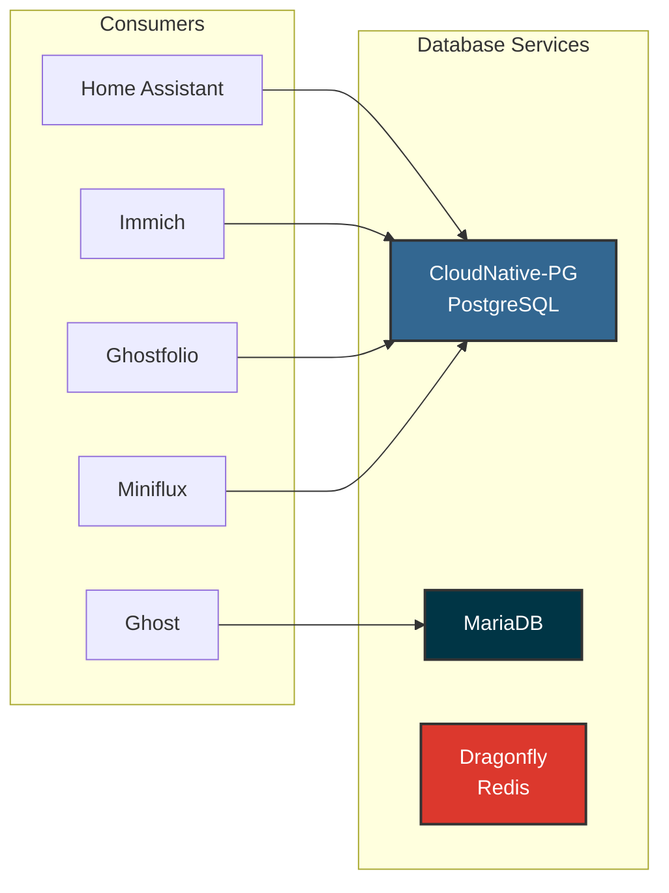
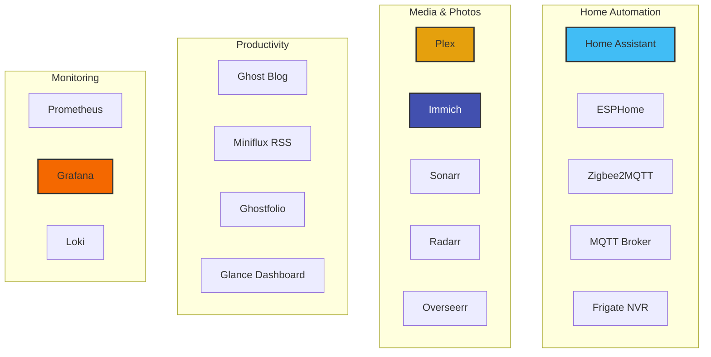
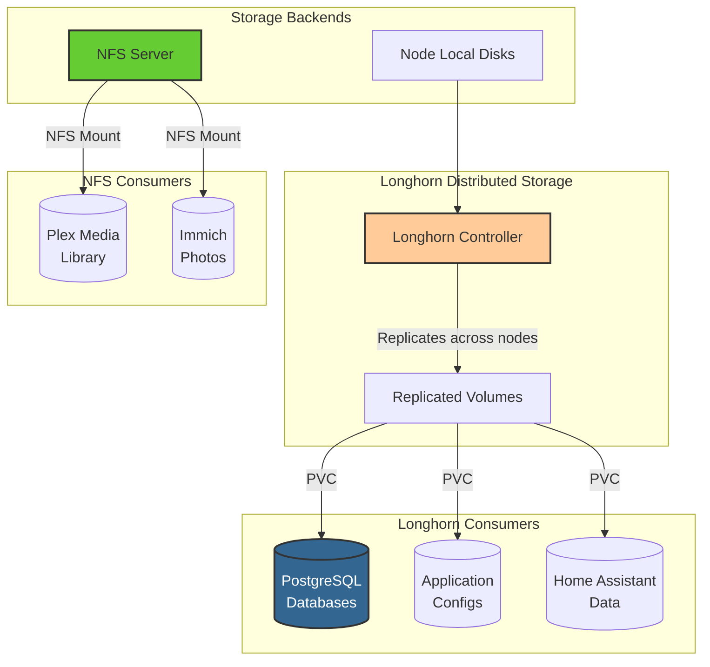
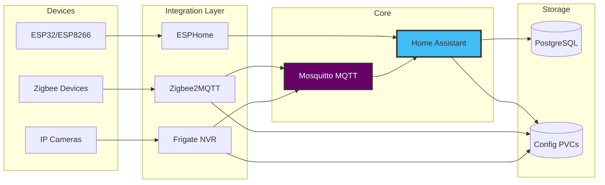
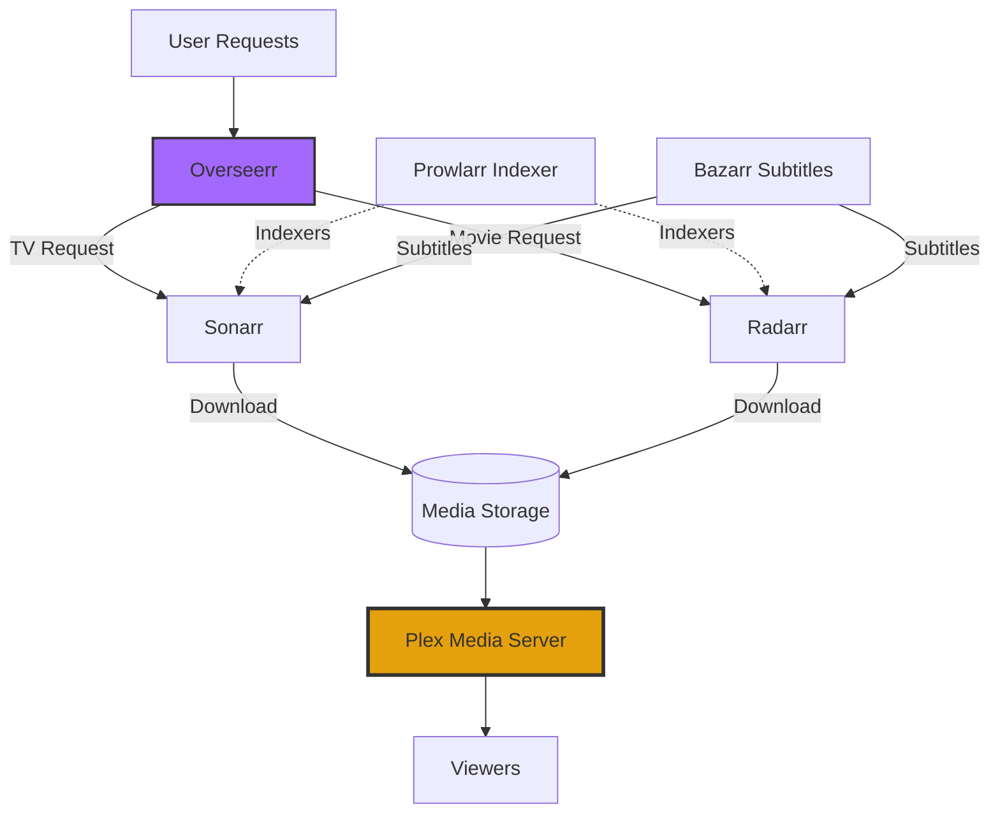

## Overview

This repository contains a GitOps-managed Kubernetes homelab cluster running k3s on Ubuntu nodes. The cluster hosts home automation, media services, databases, monitoring, and various web applications.

### Key Technologies

- **Kubernetes**: k3s lightweight distribution
- **GitOps**: Flux CD for continuous delivery
- **Networking**: Cilium CNI with Gateway API
- **Storage**: Longhorn distributed block storage
- **Database**: CloudNative-PG (PostgreSQL), MariaDB, Redis (Dragonfly)
- **Secrets**: SOPS encryption with Age/GPG
- **Certificates**: cert-manager for TLS

## Architecture

### Infrastructure Layer



### Data Services



### Application Services



### Storage Architecture



### Home Automation Stack



### Media Automation Stack



## :open_file_folder:&nbsp; Repository structure

The Git repository contains the following directories under `cluster` and are ordered below by how Flux will apply them.

- **base** directory is the entrypoint to Flux
- **crds** directory contains custom resource definitions (CRDs) that need to exist globally in your cluster before anything else exists
- **core** directory (depends on **crds**) are important infrastructure applications (grouped by namespace) that should never be pruned by Flux
- **apps** directory (depends on **core**) is where your common applications (grouped by namespace) could be placed, Flux will prune resources here if they are not tracked by Git anymore

```
cluster
├── apps
│   ├── default
│   ├── networking
│   └── system-upgrade
├── base
│   └── flux-system
├── core
│   ├── cert-manager
│   ├── metallb-system
│   ├── namespaces
│   └── system-upgrade
└── crds
    └── cert-manager
```
